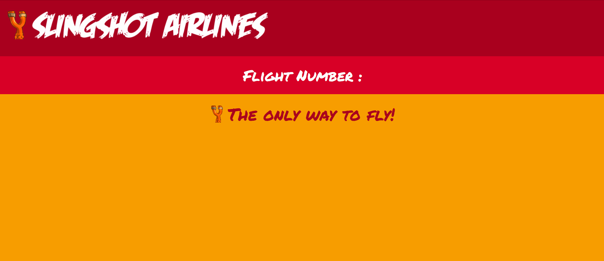
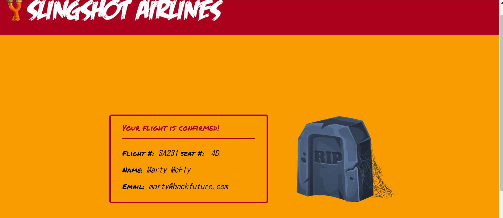

# Module 3 - Node project

Seat-booking app for SlingAir airlines.

With /seat-select we access the flight selection page and then connect to an API to access the available flights and their specific informations.
Once the reservation sent, the local server will validate the new reservation with the API and return a confirmation page.

With /admin we access information from previous reservations. 
/admin/all returns a list of all reservations
/admin/search returns a page that allows the user to enter an ID number or email and will then send back the corresponding confirmation page.